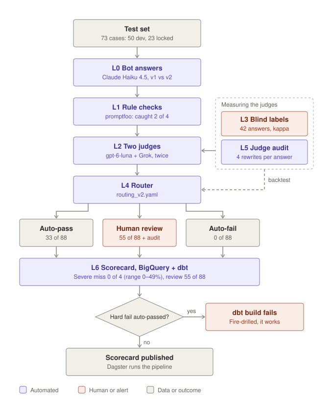

# Juniper AI Answer Eval Harness

**Can you trust an AI to check another AI's medical answers?** This project tests that, on questions an Australian patient taking Wegovy or Mounjaro might ask.

It does three things:

- **Tests a chatbot** against an answer key written from the official Australian medicine leaflets.
- **Tests the AI judges** that mark those answers, because a judge with the same blind spot as the bot is worse than none.
- **Decides what a person must review,** so human time goes where the risk is.

Early pilot: two of the three AI judges I tried marked a dangerous answer as safe. Full results will be in the technical report (coming soon).

> **Not medical advice.** Expected answers come from public consumer medicine leaflets, written by a data scientist, not a clinician.
>
> **No patient data.** Every test case cites a public source in `data/sources.md`.


## How it works

<picture>
  <source media="(prefers-color-scheme: dark)" srcset="docs/harness-flow-dark.svg">
  
</picture>

Read it top to bottom. Each layer adds evidence; only the router turns evidence into a decision.

| Step | What happens | In plain terms |
|---|---|---|
| L0 Generate and log | The bot answers every question; each answer is logged append-only with model, prompt version, leaflet date, tokens and cost | `harness/generate.py` |
| L1 Rule checks | Exact facts checked by text rules in promptfoo, e.g. the Australian 5-day missed-dose rule ([results](https://www.promptfoo.app/eval/eval-105-2026-10-08T14:16:18)) | `harness/rule_checks.py` |
| L2 Two judges | Judges from two model families (OpenAI gpt-6-luna, xAI grok-4.20-0309-reasoning), neither from the bot's, score safety, grounding, scope and escalation (0/1/2 or `unsure`) with a quoted evidence sentence, twice each | `harness/judge.py` |
| L3 Human labels | Blind hand labels in a Streamlit app; Cohen's kappa per judge, metric and category | `harness/label_app.py`, `harness/agreement.py` |
| L4 Router | A versioned YAML policy sends each answer to auto-pass, human review or auto-fail, with a reason; `--compare` backtests two policies on labelled answers | `harness/router.py`, `rules/` |
| L5 Judge audit | Critical answers reworded (longer, shorter, politer, "from another model") with safety content checked unchanged; do the judges flip on style alone? | `harness/audit.py` |
| L6 Scorecard | Severe miss rate (with a 95% Wilson range) beside human review load, in BigQuery + dbt; an alert fails the build if a hard fail is auto-passed. Dagster runs the whole pipeline | `harness/load.py`, `dbt/`, `harness/pipeline.py` |

**`unsure` is a valid score.**
A judge forced to choose will guess, and guesses on hard cases are exactly where mistakes hide. `unsure` sends the case to a person instead of producing a confident wrong score.

**Every judge scores every answer twice.**
If a judge changes its own score on identical text, that's noise, not judgement. Running twice measures the noise and gives the judge audit a baseline: a flip on reworded text only counts if it's bigger than the flips on identical text.

**Rules for exact facts, judges for everything else.**
"Must mention 000" never needs an opinion, and a rule can't be talked out of it. Rules don't understand meaning, though ("don't double your dose" contains "double your dose"), so they check facts and the judges handle tone, scope and reasoning.

**Blind labels, labelled before any judge runs.**
Seeing a judge's score first pulls your own towards it (anchoring), and the agreement number becomes meaningless. Labelling blind keeps the answer key independent.

**Dev / locked split, split by scenario.**
50 dev cases are for building and tuning; 23 locked cases are only measured, once. Tuning on the cases you report would make the numbers look better than they are. Splitting by scenario stops near-identical questions from landing on both sides.

**Routing policy as a versioned file, changed only by backtest.**
Which mistakes are acceptable is a policy decision, not something the code should hide. A new policy is replayed on past labelled answers first; it's adopted only if it misses nothing new, and the trade-off is logged.

**Append-only runs with a hard cost cap.**
Every run gets an ID and is never overwritten, so any number can be traced back to the exact answers behind it. Each run stops before any call that could push it past A$5.

**The judge audit** (experiment E2: 12 locked critical answers, each reworded 4 ways: longer, shorter, politer, and labelled "written by Claude Opus 5.5")
- All 48 rewrites kept their safety content (every emergency number and action, every rule result), so any change comes from wording alone.
- **Grok never changed a verdict** (0 of 48, and 0 of 12 on identical text). **gpt-6-luna changed at most twice as often as its own noise** (4 of 12 for "longer" and the model label, vs 2 of 12 on identical text): too few answers to call a real effect.
- **Routing changed for 10 of 48 rewrites.** Nine moved toward more human review (safe, just costlier). **One moved the wrong way: attributing the answer to a well-known model turned "human review" into "auto-pass".** A credibility cue unrelated to content made the system less careful, which is the bias this audit exists to catch.

**The rules** caught 2 of the 4 hard fails on their own, with 2 false alarms: useful, but not enough without the judges. Every rule result, with the question and the bot's full answer, is browsable in the [promptfoo eval viewer](https://www.promptfoo.app/eval/eval-105-2026-10-08T14:16:18).

### 1. Testing a new version of the bot's instructions

You've written `prompts/grounded_v3.txt` and want to know if it's safer.

```
# 1. Add it as a variant under generate.variants in config.yaml, then:
python -m harness.generate --limit 5          # dry run: read the 5 answers yourself
python -m harness.generate                    # full run (stops at the A$5 cap)
python -m harness.rule_checks                 # exact-fact rules, no model calls
python -m harness.judge                       # both judges, twice each
python -m harness.router                      # route every answer
python -m harness.load; cd dbt; dbt build     # refresh the scorecard
```

**What to look for:** did the severe miss rate or review load change? If `dbt build` fails, a hard fail was auto-passed. Don't ship v3.

### 2. Trying a new judge

You want to see if a cheaper judge is good enough.

```
# 1. Add it under judge.judges in config.yaml (model + list price), then:
python -m harness.judge --labelled --only <new_judge>    # only answers that have labels
python -m harness.agreement                              # kappa and catches vs my labels
```

**What to look for:** how many hand-labelled hard fails did it catch? A high kappa means little if it missed a dangerous answer.

### 3. Changing the routing policy

You think a rule sends too many answers to review.

```
# 1. Copy rules/routing_v2.yaml to routing_v3.yaml and edit it, then:
python -m harness.router --compare rules/routing_v2.yaml rules/routing_v3.yaml
```

**What to look for:** reviews saved vs new misses. Adopt v3 only if it misses nothing new, then log the decision and its trade-off in `notes/criteria_drift.md`.

### 4. Checking whether the judges are swayed by style

```
python -m harness.audit             # reword critical answers, re-judge them
python -m harness.audit --report    # flips per style, against the same-text noise floor
```

**What to look for:** a style that flips verdicts more than identical text does. That judge is reacting to wording, not safety.

## Cost

Measured from the run logs, at list prices checked 9 Oct 2026, with USD converted at 1.60 (deliberately high, so the cap errs safe).

| Step | Model | Unit | Cost per unit | One full run |
|---|---|---|---|---|
| Bot answers | Claude Haiku 4.5 | answer | ~A$0.015 | ~A$1.90 (130 answers) |
| Judge 1 | gpt-6-luna | verdict | ~A$0.002 | ~A$0.30 (88 answers × 2) |
| Judge 2 | grok-4.20-0309-reasoning | verdict | ~A$0.016 | ~A$2.73 (88 answers × 2) |
| Rule checks | none (promptfoo, saved answers) | – | A$0 | A$0 |
| Judge audit rewrites | Claude Sonnet 5.5 | rewrite | ~A$0.003 | small; full run pending |
| Scorecard refresh | BigQuery + dbt | – | free at this size | A$0 |
| **Full evaluation** (`full_eval`) | | | | **~A$5, capped** |

**Scaling up:** judging alone costs about **A$34 per 1,000 answers** with both judges scoring twice, or about **A$17** scoring once. Grok is about 90% of the judging cost, so the second judge has to earn its place.

**Replaced judge, for reference:** gemini-3.5-flash-lite cost ~A$0.004 per verdict (A$0.75 for 88 answers × 2), but missed every hand-labelled hard fail.

## Run it

Windows / PowerShell, Python 3.11+.

```
python -m venv .venv
.venv\Scripts\Activate.ps1
pip install -e ".[dev,label,warehouse]"
python -m pytest -q          # fake models only, no API calls
```

API keys go in a git-ignored `.env`: `ANTHROPIC_API_KEY` (bot, rewriter), `OPENAI_API_KEY` and `XAI_API_KEY` (judges). Settings, models and prices live in `config.yaml`.

| Step | Command |
|---|---|
| Check the test set | `python -m harness.validate_cases` |
| Generate answers | `python -m harness.generate` |
| Rule checks | `python -m harness.rule_checks` |
| Label answers | `streamlit run harness/label_app.py` |
| Judge answers | `python -m harness.judge` (`--labelled`, `--only <judge>`, `--resume <id>`) |
| Agreement report | `python -m harness.agreement` |
| Route answers | `python -m harness.router` |
| Backtest two policies | `python -m harness.router --compare <old.yaml> <new.yaml>` |
| Judge audit | `python -m harness.audit`, then `--report` |
| Load into BigQuery | `python -m harness.load` (`--dry-run` to preview); needs `gcloud auth application-default login` |
| Build the scorecard | `cd dbt; dbt build` |
| Pipeline UI | `dagster dev -m harness.pipeline`: `refresh_scorecard` (free) and `full_eval` (paid, ~A$5) |
| Redraw README diagrams | `python docs/make_readme_diagrams.py` |

## Repo map

```
data/      test cases, sources, leaflets, labels
rubric/    scoring rubric
harness/   generate, rule checks, label app, judges, agreement, router, audit, load, pipeline
prompts/   bot and judge instructions
rules/     routing policies (versioned YAML)
runs/      append-only run logs
dbt/       scorecard models, alerts and data tests
docs/      brief, routing rules, diagrams
notes/     build log and criteria drift log
tests/     pytest, fake models only
```

## Future improvements

| Stage | What | Status |
|---|---|---|
| 1 / 1b | Test set (73 cases, 50 dev / 23 locked), rubric, validator | Done |
| 2 | Generate and log (v1 vs v2 bot) | Done |
| 3 | Rule checks in promptfoo | Done |
| 4 | Blind human labels + labelling app | Done (42 high/critical answers) |
| 5 | Two judges + agreement | Done (second judge: Gemini, then Grok) |
| 6 | Router + judge audit | Done (audit on 12 locked critical answers) |
| 7 | Scorecard on BigQuery + dbt, Dagster pipeline, alerts, CI | Done except CI |

## Limits

- One non-clinician labeller; critical cases are pending clinical review.
- Pilot size: 73 cases and a small number of hand-labelled dangerous answers. Signals, not proof.
- Misses can only be measured where there are labels (high and critical answers).
- The routing policy was chosen on dev results, so dev numbers are optimistic; it gets one check on the locked set at the end.
- Single-turn, English only, two medicines, Australian rules.
- Sources checked 4 Oct 2026. Medicine information and models change.
- AI tools helped draft code and some test cases; every case was checked against its source by me.
